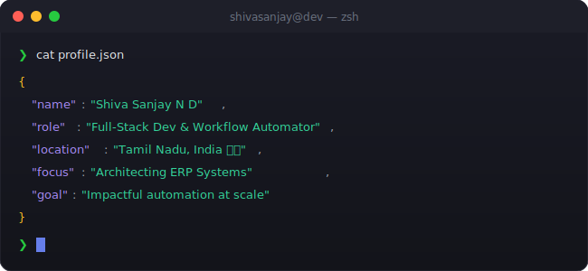
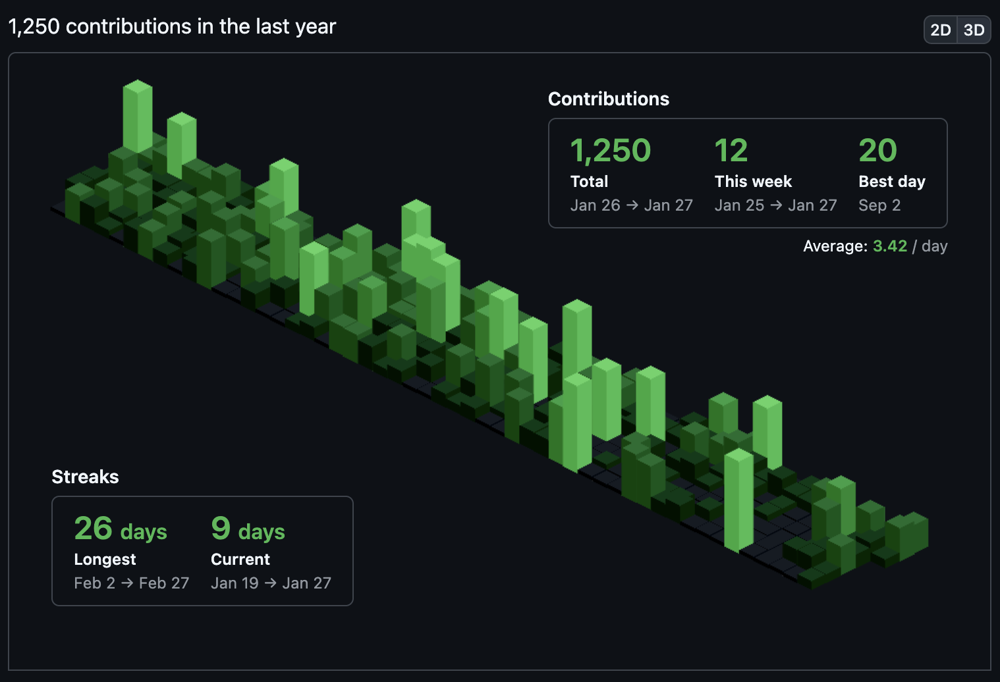

<!-- 
╔══════════════════════════════════════════════════════════════════════════════╗
║                                                                              ║
║        ███████╗██╗  ██╗██╗██╗   ██╗███████╗                                  ║
║        ██╔════╝██║  ██║██║██║   ██║██╔════╝                                  ║
║        ███████╗███████║██║██║   ██║███████╗                                  ║
║        ╚════██║██╔══██║██║╚██╗ ██╔╝██╔══██║                                  ║
║        ███████║██║  ██║██║ ╚████╔╝ ██║  ██║                                  ║
║        ╚══════╝╚═╝  ╚═╝╚═╝  ╚═══╝  ╚═╝  ╚═╝                                  ║
║                                                                              ║
║   ███████╗█████╗ ███╗   ██╗██╗ █████╗ ██╗   ██╗                              ║
║   ██╔════╝██╔══██╗████╗  ██║██║██╔══██╗╚██╗ ██╔╝                             ║
║   ███████╗███████║██╔██╗ ██║██║███████║ ╚████╔╝                              ║
║   ╚════██║██╔══██║██║╚██╗██║██║██╔══██║  ╚██╔╝                               ║
║   ███████║██║  ██║██║ ╚████║██║██║  ██║   ██║                                ║
║   ╚══════╝╚═╝  ╚═╝╚═╝  ╚═══╝╚═╝╚═╝  ╚═╝   ╚═╝                                ║
║                                                                              ║
║        🚀 FULL-STACK DEVELOPER • WORKFLOW AUTOMATOR • SPORTSMAN 🚀           ║
║                                                                              ║
╚══════════════════════════════════════════════════════════════════════════════╝
-->

<div align="center">
  
  <!-- ═══════════════════════════════════════════════════════════════════════════ -->
  <!-- 🎯 ANIMATED HEADER                                                          -->
  <!-- ═══════════════════════════════════════════════════════════════════════════ -->
  
  

  

  <br/><br/>
  
  <!-- ═══════════════════════════════════════════════════════════════════════════ -->
  <!-- 📊 PROFILE BADGES                                                           -->
  <!-- ═══════════════════════════════════════════════════════════════════════════ -->
  
  <a href="https://github.com/SHIVASANJAY2007">
    
  </a>
  &nbsp;
  <a href="https://github.com/SHIVASANJAY2007?tab=repositories">
    
  </a>
  &nbsp;
  <a href="https://github.com/SHIVASANJAY2007?tab=followers">
    
  </a>
  &nbsp;
  <a href="https://github.com/SHIVASANJAY2007">
    
  </a>
  
</div>

<br/>

<!-- ═══════════════════════════════════════════════════════════════════════════ -->
<!-- 🖥️ TERMINAL INTRO SECTION                                                   -->
<!-- ═══════════════════════════════════════════════════════════════════════════ -->

<div align="center">
  
</div>

<br/>


<br/>

<!-- ═══════════════════════════════════════════════════════════════════════════ -->
<!-- 👤 ABOUT ME SECTION                                                          -->
<!-- ═══════════════════════════════════════════════════════════════════════════ -->


<br/><br/>

<table>
<tr>
<td width="55%" valign="top">

### 🎯 What I Do

```yaml
name: Shiva Sanjay N D
located_in: Tamil Nadu, India 🇮🇳
current_status: Student & Full-Stack Developer

areas_of_expertise:
  - 🌐 Full-Stack Web Development
  - ⚙️ Business Workflow Automation (n8n)
  - 💼 CRM & ERP Architecture
  - 🏆 Leadership & Sports Strategy

currently_building:
  - Finexa AI (Fintech Advisory)
  - Velson ERP (Manufacturing Software)
  - Next-gen AI automation solutions

life_philosophy: "Discipline on the field builds discipline in the codebase."
```

</td>
<td width="45%" valign="top">

### 🚀 Current Focus

- 🏗️ **Architecting** full-stack web applications
- ⚡ **Automating** real-world business workflows
- 🌱 **Deepening** my skills in Salesforce & Cybersecurity
- 🏃‍♂️ **Leading** my Kho-Kho team as Captain
- 📚 **Pursuing** B.Sc. Information Systems at Kongu Engineering College

<br/>

### 💡 Quick Facts

- 🏅 State-Level Kho-Kho Captain (Multiple wins)
- 🔥 Passionate about automation & AI
- 💡 Xackathon Winner at Xenovex Technologies
- ☕ Driven by details and competitive spirit

</td>
</tr>
</table>

<br/>


<br/>

<!-- ═══════════════════════════════════════════════════════════════════════════ -->
<!-- 🏆 ACHIEVEMENTS SECTION                                                     -->
<!-- ═══════════════════════════════════════════════════════════════════════════ -->


<br/><br/>

<div align="center">
  
  <!-- GitHub Trophies -->
  <a href="https://github.com/ryo-ma/github-profile-trophy">
    
  </a>
  
</div>

<br/>

<div align="center">

<table align="center">
  <tr>
    <td align="center" width="50%">
      <br/>
      <h1>🏆</h1>
      <h3>1st Prize — POC Fitlee</h3>
      <p><i>Awarded by Dept. HOD</i></p>
    </td>
    <td align="center" width="50%">
      <br/>
      <h1>🚀</h1>
      <h3>Winner — Xackathon 2k25</h3>
      <p><i>Xenovex Technologies</i></p>
    </td>
  </tr>
  <tr>
    <td align="center" width="50%">
      <br/>
      <h1>🎯</h1>
      <h3>Back-to-Back Wins</h3>
      <p><i>Marketing Events</i></p>
    </td>
    <td align="center" width="50%">
      <br/>
      <h1></h1>
      <h3>State-Level Kho-Kho</h3>
      <p><i>Team Captain • Multiple Tournament Wins</i></p>
    </td>
  </tr>
</table>

</div>

<br/>


<br/>

<!-- ═══════════════════════════════════════════════════════════════════════════ -->
<!-- 📊 GITHUB ANALYTICS                                                         -->
<!-- ═══════════════════════════════════════════════════════════════════════════ -->


<br/><br/>

<div align="center">
  
  <!-- GitHub Stats + Custom Streak in ONE ROW -->
  <a href="https://github.com/SHIVASANJAY2007">
    
  </a>
  &nbsp;
  <a href="https://github.com/SHIVASANJAY2007">
    
  </a>
  
  <br/><br/>
  
  <!-- 📊 REAL-TIME LANGUAGE USAGE WITH PROGRESS BARS -->
  <a href="https://github.com/SHIVASANJAY2007">
    
  </a>
  
  <br/><br/>
  
  <!-- Activity Graph -->
  <a href="https://github.com/SHIVASANJAY2007">
    
  </a>
  
  <br/><br/>
  
  <!-- Additional Stats Cards -->
  
  
</div>

<br/>


<br/>

<!-- ═══════════════════════════════════════════════════════════════════════════ -->
<!-- 🎮 CONTRIBUTION SHOWCASE                                                    -->
<!-- ═══════════════════════════════════════════════════════════════════════════ -->


<br/><br/>

<div align="center">
  
  <!-- Breakout Contribution Graph -->
  <picture>
    <source media="(prefers-color-scheme: dark)" srcset="https://raw.githubusercontent.com/SHIVASANJAY2007/SHIVASANJAY2007/output/breakout-contribution-graph-dark.svg">
    <source media="(prefers-color-scheme: light)" srcset="https://raw.githubusercontent.com/SHIVASANJAY2007/SHIVASANJAY2007/output/breakout-contribution-graph.svg">
    
  </picture>
  
  <br/><br/>
  
  <!-- Pac-Man Contribution Graph -->
  <picture>
    <source media="(prefers-color-scheme: dark)" srcset="https://raw.githubusercontent.com/SHIVASANJAY2007/SHIVASANJAY2007/output/pacman-contribution-graph-dark.svg">
    <source media="(prefers-color-scheme: light)" srcset="https://raw.githubusercontent.com/SHIVASANJAY2007/SHIVASANJAY2007/output/pacman-contribution-graph.svg">
    
  </picture>
  
  <br/><br/>
  
  <!-- Isometric Contribution Graph (Dark Theme) -->
  
  
  <br/>
  
  <sub>🧱 Watch Breakout & Pac-Man devour my contributions, and check out my Isometric Contributions!</sub>
  
</div>

<br/>


<br/>

<!-- ═══════════════════════════════════════════════════════════════════════════ -->
<!-- ⚡ TECH STACK                                                               -->
<!-- ═══════════════════════════════════════════════════════════════════════════ -->


<br/><br/>

<div align="center">

<h3 align="center">💻 Languages Known</h3>
<p align="center">
  
  
  
  
  
</p>

<h3 align="center">📝 Code Editors & AI Workspace</h3>
<p align="center">
  
  
  
  
  
  
</p>

<h3 align="center">⚙️ Full Stack / MERN Stack</h3>
<p align="center">
  
  
  
  
  
  <br/>
  
  
  
  
  
  
</p>

<h3 align="center">🧩 Other Tools, CRM & ERP</h3>
<p align="center">
  
  
  
  
  
  
  
</p>

</div>

<br/>


<br/>

<!-- ═══════════════════════════════════════════════════════════════════════════ -->
<!-- 🚀 FEATURED PROJECTS                                                          -->
<!-- ═══════════════════════════════════════════════════════════════════════════ -->

<div align="center">
  
### 🚀 Featured Projects

</div>

<br/>

<details open>
<summary><b>💰 Finexa AI</b> — AI-powered personal finance advisory platform</summary>
<br/>
<blockquote>
Financial profiling wizard, multi-chart dashboard (Recharts), and an AI advisor chat — built end-to-end for the Indian fintech market, including a full investor-facing platform blueprint.
<br/><br/>
  
</blockquote>
</details>

<details open>
<summary><b>🏭 Velson ERP</b> — Web-based ERP for hardware manufacturing</summary>
<br/>
<blockquote>
Centralized master-data architecture with modular submodules, backed by hardened agent-instruction documents (`seedDATA.md`, `GenerateReport.md`) for reliable test data and auto-generated technical docs.
<br/><br/>
  
</blockquote>
</details>

<details>
<summary><b>🏋️ Fitlee 🏆</b> — Gamified fitness platform (1st Prize, Proof of Concept 2025)</summary>
<br/>
<blockquote>
Full-stack MERN app with an NFT-based reward system for milestone tracking and an AI chatbot for personalized fitness guidance.
<br/><br/>
 
</blockquote>
</details>

<details>
<summary><b>✈️ Zyvox AI 🏆</b> — Automated travel assistant (Xackathon Winner, Xenovex Technologies)</summary>
<br/>
<blockquote>
WhatsApp Business bot delivering real-time, personalized itinerary planning through n8n-driven automation workflows.
<br/><br/>
 
</blockquote>
</details>

<br/>


<br/>

<!-- ═══════════════════════════════════════════════════════════════════════════ -->
<!-- 🌐 CONNECT WITH ME                                                          -->
<!-- ═══════════════════════════════════════════════════════════════════════════ -->


<br/><br/>

<div align="center">
  
<a href="https://github.com/SHIVASANJAY2007" target="_blank">
  
</a>
&nbsp;
<a href="https://www.linkedin.com/in/shiva-sanjay-610512320" target="_blank">
  
</a>
&nbsp;
<a href="https://www.instagram.com/_.kho_kho._.shivuuu._/" target="_blank">
  
</a>
&nbsp;
<a href="mailto:sanjudragon2007@gmail.com">
  
</a>

<br/><br/>

*"Discipline on the field, precision in the code."*

</div>

<br/>


<br/>

<!-- ═══════════════════════════════════════════════════════════════════════════ -->
<!-- 💡 RANDOM DEV QUOTE                                                         -->
<!-- ═══════════════════════════════════════════════════════════════════════════ -->

<div align="center">
  
### 💭 Random Dev Quote

<br/>

<a href="https://github.com/SHIVASANJAY2007">
  
</a>

</div>

<br/>

<!-- ═══════════════════════════════════════════════════════════════════════════ -->
<!-- 🌟 FOOTER                                                                   -->
<!-- ═══════════════════════════════════════════════════════════════════════════ -->

<div align="center">
  
  
  
  <br/><br/>
  
  
  
</div>

<!-- ═══════════════════════════════════════════════════════════════════════════ -->
<!-- 📝 END OF README                                                            -->
<!-- ═══════════════════════════════════════════════════════════════════════════ -->