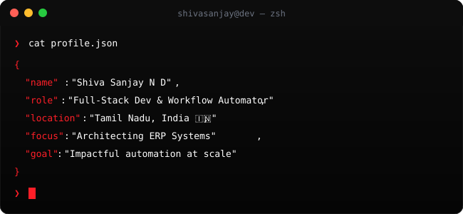
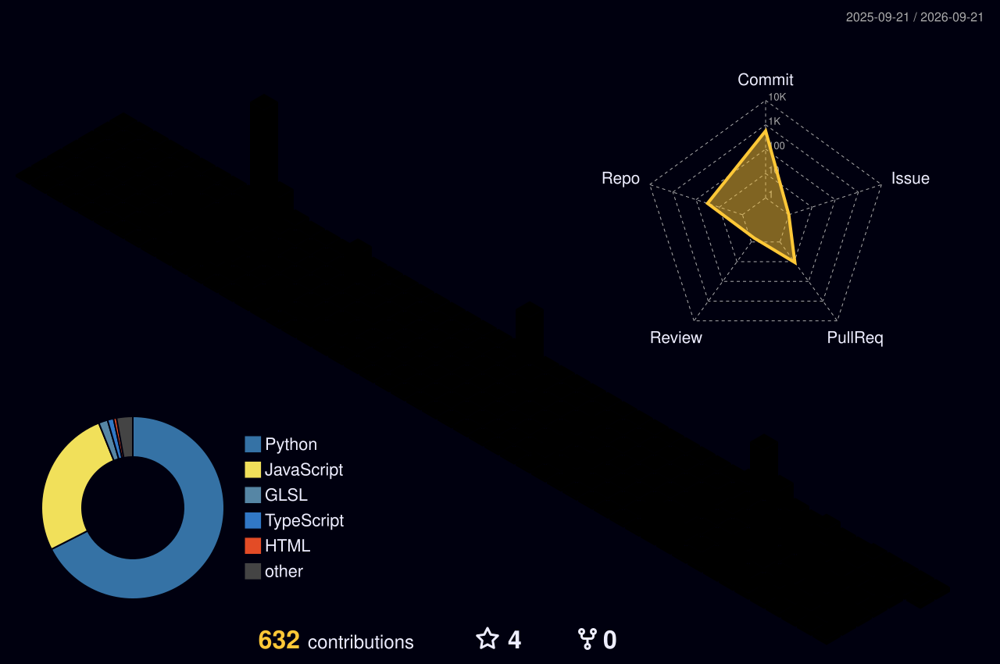
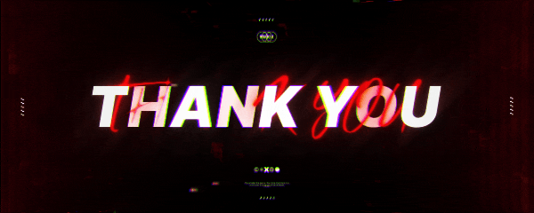

  
  
  

  
  <!-- ═══════════════════════════════════════════════════════════════════════════ -->
  <!-- 📊 PROFILE BADGES                                                           -->
  <!-- ═══════════════════════════════════════════════════════════════════════════ -->
  
  
  &nbsp;
  
  &nbsp;
  
  &nbsp;
  
  

<!-- ═══════════════════════════════════════════════════════════════════════════ -->
<!-- 🖥️ TERMINAL INTRO SECTION                                                   -->
<!-- ═══════════════════════════════════════════════════════════════════════════ -->

  

<!-- ═══════════════════════════════════════════════════════════════════════════ -->
<!-- 👤 ABOUT ME SECTION                                                          -->
<!-- ═══════════════════════════════════════════════════════════════════════════ -->

### 🎯 What I Do

  <table align="center" width="100%">
    <tr>
      <td width="33%" align="center">
        <h2>🌐</h2>
        <b>AI & Web Development</b>
      </td>
      <td width="33%" align="center">
        <h2>⚙️</h2>
        <b>Workflow Automation (n8n)</b>
      </td>
      <td width="33%" align="center">
        <h2>💼</h2>
        <b>CRM & ERP Solutions</b>
      </td>
    </tr>
  </table>

> **🚀 Currently Building & Exploring:**
> - 🤖 **INGRES:** AI-powered chatbot for intelligent groundwater data retrieval
> - 🛡️ **FADE:** Instagram Fake Account Detection Engine utilizing Machine Learning
> - 🌱 Deepening skills in **Salesforce** and **Cybersecurity** to build robust systems

> **💡 Quick Facts & Leadership:**
> - 🏅 **Team Captain** (Multiple State-Level Kho-Kho wins) | 👔 **Association Joint Secretary** (KEC)
> - 🏆 **Xackathon-2025 Winner** (Xenovex Technologies)
> - 📚 Pursuing B.Sc. Information Systems at Kongu Engineering College (2024 - 2027)

  <i>"Discipline on the field builds discipline in the codebase."</i>

<!-- ═══════════════════════════════════════════════════════════════════════════ -->
<!-- 🏆 ACHIEVEMENTS SECTION                                                     -->
<!-- ═══════════════════════════════════════════════════════════════════════════ -->

  
  <!-- GitHub Trophies -->
  
  

<table align="center">
  <tr>
    <td align="center" width="50%">
      <h1></h1>
      <h3>1st Prize — POC Fitlee</h3>
      
<i>Awarded by Dept. HOD</i>

    </td>
    <td align="center" width="50%">
      <h1></h1>
      <h3>Winner — Xackathon 2k25</h3>
      
<i>Xenovex Technologies</i>

    </td>
  </tr>
  <tr>
    <td align="center" width="50%">
      <h1></h1>
      <h3>Back-to-Back Wins</h3>
      
<i>Marketing Events</i>

    </td>
    <td align="center" width="50%">
      <h1></h1>
      <h3>State-Level Kho-Kho</h3>
      
<i>Team Captain • Multiple Tournament Wins</i>

    </td>
  </tr>
</table>

<!-- ═══════════════════════════════════════════════════════════════════════════ -->
<!-- 📊 GITHUB ANALYTICS                                                         -->
<!-- ═══════════════════════════════════════════════════════════════════════════ -->

  
  <!-- GitHub Stats + Custom Streak in ONE ROW -->
  
  
  
  
  
  
  <!-- 📊 REAL-TIME LANGUAGE USAGE WITH PROGRESS BARS -->
  
  

  
  
  <!-- Pac-Man Contribution Graph -->
  <picture>
    <source media="(prefers-color-scheme: dark)" srcset="https://raw.githubusercontent.com/SHIVASANJAY2007/SHIVASANJAY2007/output/pacman-contribution-graph-dark.svg">
    <source media="(prefers-color-scheme: light)" srcset="https://raw.githubusercontent.com/SHIVASANJAY2007/SHIVASANJAY2007/output/pacman-contribution-graph.svg">
    
  </picture>
  
  
  <!-- Isometric Contribution Graph (Dark Theme) -->
  
  
  

<h3 align="center">💻 Languages Known</h3>

  
  
  
  
  

<h3 align="center">📝 Code Editors & AI Workspace</h3>

  
  
  
  
  
  

<h3 align="center">⚙️ Full Stack / MERN Stack</h3>

  
  
  
  
  
  
  
  
  
  
  

<h3 align="center">🧩 Other Tools, CRM & ERP</h3>

  
  
  
  
  
  
  

  
### 🚀 Featured Projects

<b>🤖 INGRES</b> — AI-powered chatbot for the INGRES platform

<blockquote>
Designed and developed an AI-powered chatbot for the INGRES platform, enabling intelligent groundwater data retrieval through natural language queries with multilingual support.

</blockquote>

<b>🛡️ FADE</b> — Instagram Fake Account Detection Engine

<blockquote>
Developed an Instagram Fake Account Detection Engine using machine learning to analyze profile authenticity, generate real-time risk scores, and identify suspicious accounts through an interactive 3D user interface.
 
</blockquote>

<b>🏋️ Fitlee 🏆</b> — Gamified fitness platform (1st Prize, Proof of Concept 2025)

<blockquote>
Prize-winning fitness web application featuring an NFT-based reward system to gamify user engagement and milestone tracking. Integrated an AI chatbot for personalized fitness guidance with a focus on usability and innovation.
 
</blockquote>

<b>✈️ Zyvox AI 🏆</b> — Automated travel assistant (Xackathon-2025 Winner, Xenovex Technologies)

<blockquote>
Team-developed AI travel assistant built using n8n to automate personalized trip planning workflows. Deployed as a WhatsApp Business bot to provide users with real-time travel suggestions and itinerary generation.
 
</blockquote>

<!-- ═══════════════════════════════════════════════════════════════════════════ -->
<!-- 🌐 CONNECT WITH ME                                                          -->
<!-- ═══════════════════════════════════════════════════════════════════════════ -->

  

&nbsp;

&nbsp;

&nbsp;

&nbsp;

*"Discipline on the field, precision in the code."*

  
### 💭Random Dev Quote

  
  
  
  
  
  

